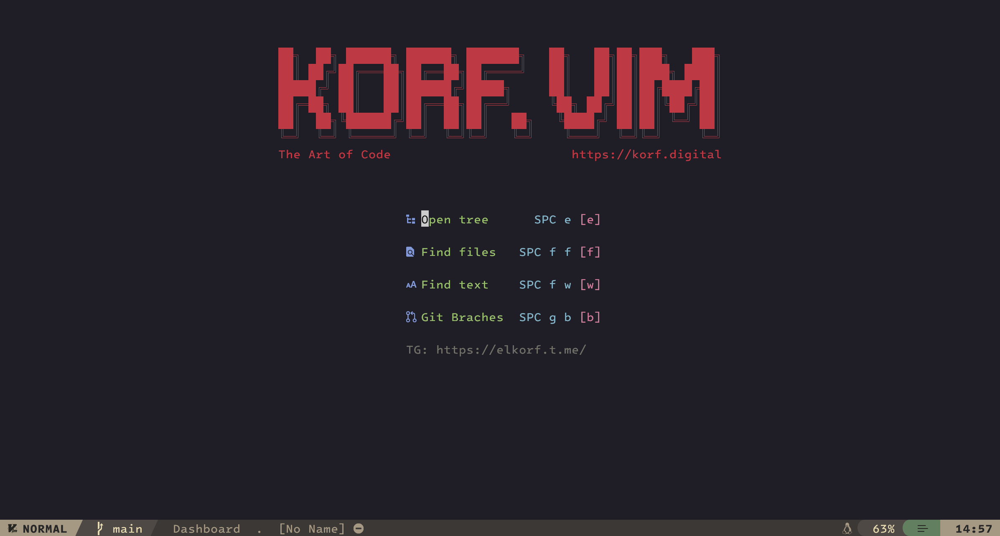

# korf.vim

A highly customized and optimized Neovim configuration focused on enhancing productivity and developer experience.



## Features

## Features
- **Native LSP Architecture** — Using Neovim 0.11+ `vim.lsp.config` and `vim.lsp.enable` for flawless code navigation.
- **Smart Dual-Engine Formatting** — `conform.nvim` with automatic Biome/Prettier/LSP fallback, ensuring no process freezing.
- **Automated Toolchain** — Built-in `mason.nvim` for isolated management of language servers and linters.
- **Modern UI** — Includes Kanagawa dark theme, custom status lines, and dashboard.
- **Additional quality-of-life improvements** and plugin integrations for a modern Neovim experience.

## Included Plugins
**korf.vim** comes preloaded and configured with essential plugins to boost your workflow, including but not limited to:
- Autocompletion plugins (e.g., `nvim-cmp`, snippets)
- LSP configuration plugins (e.g., `nvim-lspconfig`)
- Dashboard plugins for Neovim startup screen
- Various utility and UI enhancement plugins *(For a complete list, please refer to the plugin management config files.)*
- Neovim Tips Plugin (:NeovimTips)

## Installation

**Prerequisites:**
- Neovim 0.12+ installed.
- Git installed. Clone this repository and follow your preferred plugin manager's setup procedure.
- Lua and Luarocks
- Java (jdr)
- pynvim (pip install pynvim (or pip3 install pynvim))

**Example using [lazy.nvim]:**
```sh
git clone https://github.com/eliaskorf/korf.vim ~/.config/nvim
```

Open Neovim and ensure plugins are installed and compiled (depends on your plugin manager).

## Usage Open Neovim as usual:
```sh
nvim
```

## Keymaps
* `<leader>F` — Format buffer (Biome/Prettier/LSP)
* `gl` — Show diagnostic under cursor
* `<leader>q` — Project-wide diagnostics list
* `<leader>nto` — Open Neovim tip dictionary

## Configuration
Edit `~/.config/nvim/lua/plugins/` files to manage servers and formatters.


Enjoy autocompletion, LSP features, and a welcoming dashboard on startup.

## Configuration
You can customize further by editing configuration files under `~/.config/nvim/lua/` or adding more plugins as needed.

## Contributing
Contributions and feature requests are welcome! Please submit issues or pull requests on GitHub.

## License
This project is licensed under the MIT License.

*Happy hacking with korf.vim!*
